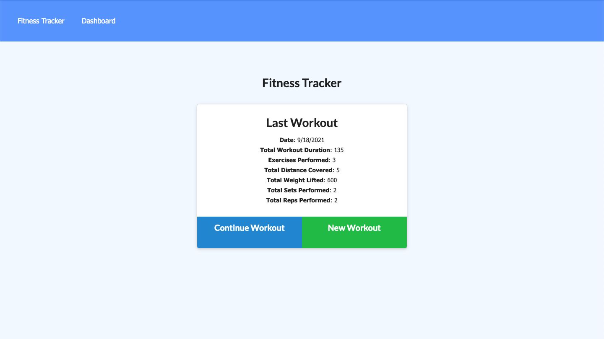
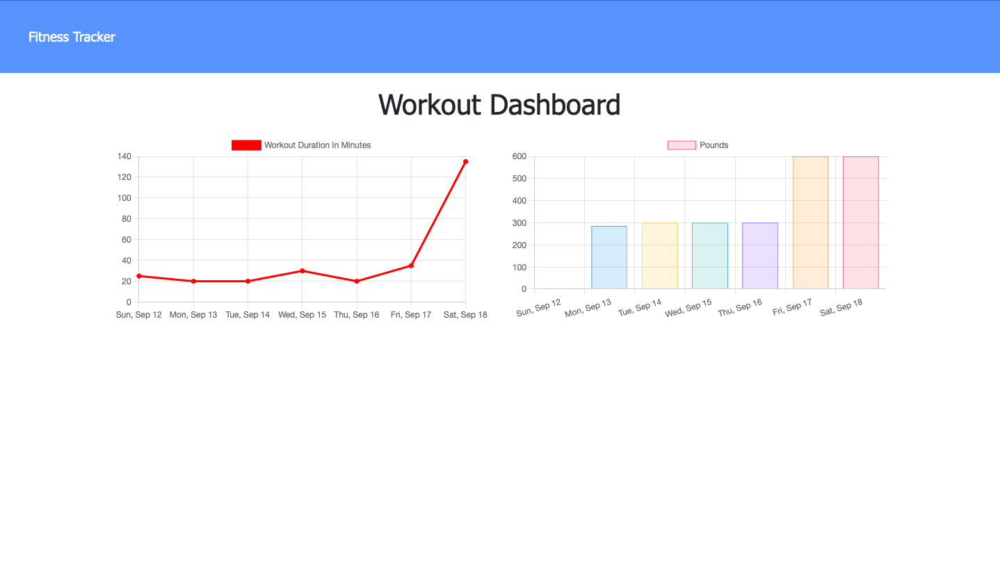

# Workout Tracker 

## Description
A small application based on MongoDB, Mongoose and Express to allow user to view and track daily workouts.

## Table of Contents
- [Installation](#installation)
- [Usage](#usage)
- [Link](#link)
- [Contribute](#contribute)
- [Questions](#questions)

## Installation
Online: Go to [YWK's Workout Tracker @ Heroku](https://ywk-workout-tracker.herokuapp.com) to run the application. 

Local: Must have MongoDB installed locally! Run "npm i" to install dependencies, run "npm run seed" to seed the database and "npm start" to start the application on localhost:3000.

## Usage
Users can reach their fitness goal faster when using this tracker to track their workout progress.

## Link:
[YWK's Workout Tracker @ Heroku](https://ywk-workout-tracker.herokuapp.com)

## Contribute
If you would like to contribute, please feel free to contact me by email.

## Questions
GitHub: [ywkuo227's GitHub](https://github.com/ywkuo227)

Email: [ywkuo@outlook.com](mailto:ywkuo@outlook.com)